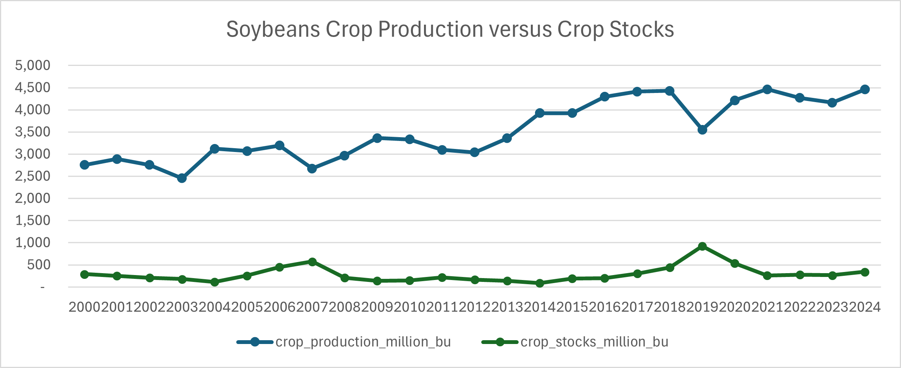

# U.S. Soybean Production, Stocks, and Crush Trend Analysis (2000–2024)

This project analyzes long-term trends in U.S. soybean production, ending stocks, and crushing volume using publicly available data from USDA NASS Quick Stats. It aims to explore the relationship between production, stock levels, and industrial demand (crush), especially under the influence of trade disruptions and weather events.

---

## 📊 Motivation

Soybeans play a vital role in the U.S. agricultural and energy landscape, serving as a major feedstock for food, animal feed, and biofuel production. By analyzing over two decades of production, stock, and crush data, this project aims to:
- Visualize historical trends across these variables,
- Identify structural shifts driven by policy or climate events,
- Understand demand resilience independent of production levels.

---

## 📁 Data Source

All data were sourced from the [USDA NASS Quick Stats](https://quickstats.nass.usda.gov/), covering the years 2000–2024:
- **Crop Production**: Measured in million bushels
- **Soybean Crush**: Measured in million bushels (converted from tons)
- **Crop Stocks**: Measured in million bushels

---

## 🧰 Tools Used

- Microsoft Excel (for data transformation and visualization)
- Manual cleaning and unit conversion

---

## 📈 Key Visualizations

### 1. Crop Production vs Crop Stocks (2000–2024)

- Stocks remain low despite a steady increase in production.
- Notable spike in stock in 2018–2019 coincides with U.S.–China trade disruptions and Midwest flooding.

### 2. Crush Volume vs Stocks (2016–2024)

- Steady increase in crush even when production drops (e.g., 2019).
- Linear trend shows rising crush demand from downstream sectors.

### 3. Production vs Crush (2016–2024)

- Crush volume rose from ~1,400 million bu to 2,481 million bu despite production fluctuation.
- Suggests strong downstream pull regardless of supply-side volatility.

---

## 🔍 Insights & Observations

- **Crush Resilience**: Soybean crush reached a record high of **2,481 million bushels** in 2023, despite production setbacks, reflecting sustained demand from soy oil and meal sectors.
- **Production Growth**: Long-term upward trend in soybean output from ~2.7B bu in 2000 to ~4.4B bu in 2024.
- **Stocks Volatility**: Sharp stockpile increases in 2018–2019 likely due to export disruptions and oversupply.

---

## 🔮 Future Work

This project could be extended by:
- Incorporating **soy oil and meal price data** to model crush margin behavior,
- Exploring **state-level trends** to detect geographic production shifts,
- Integrating **weather or export data** to understand external drivers.

---

## 📎 Project Files

Trend-Analysis-of-US-Soybean-Production/
├── README.md
├── data/
│   ├── soy_crop_production.xlsx
│   ├── soy_crush.xlsx
│   ├── soy_stocks.xlsx
│   └── Soybeans Crop Production, Stocks, Crush Analysis.xlsx
├── images/
│   ├── chart1_production_vs_stocks.png
│   ├── chart2_crush_vs_stocks.png
│   └── chart3_production_vs_crush.png
└── .gitignore

---

## 👤 Author

**Xiangyi (Brian) Ju**  
This project was completed in November 2024 as an independent agricultural data analysis effort. 

<!-- force update -->